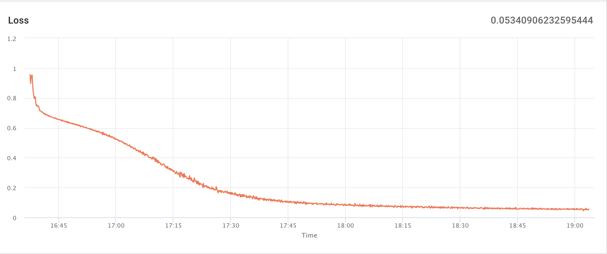
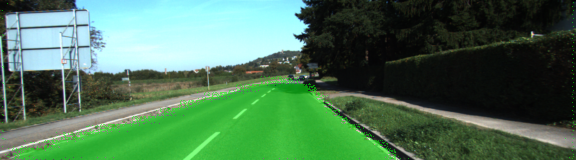
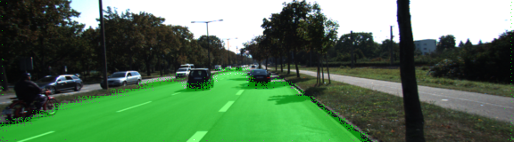
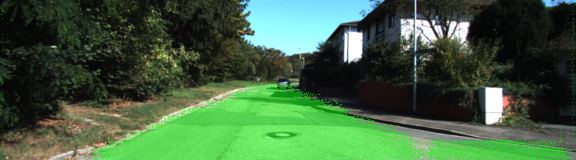

# Semantic Segmentation Project.

Goal: Identify the segmentation of the road and other parts in the picture.

## Training result

Loss was 0.0534

[Result:](https://www.floydhub.com/satoshikumano/projects/semantic-segmentation/15)

## Inference samples

